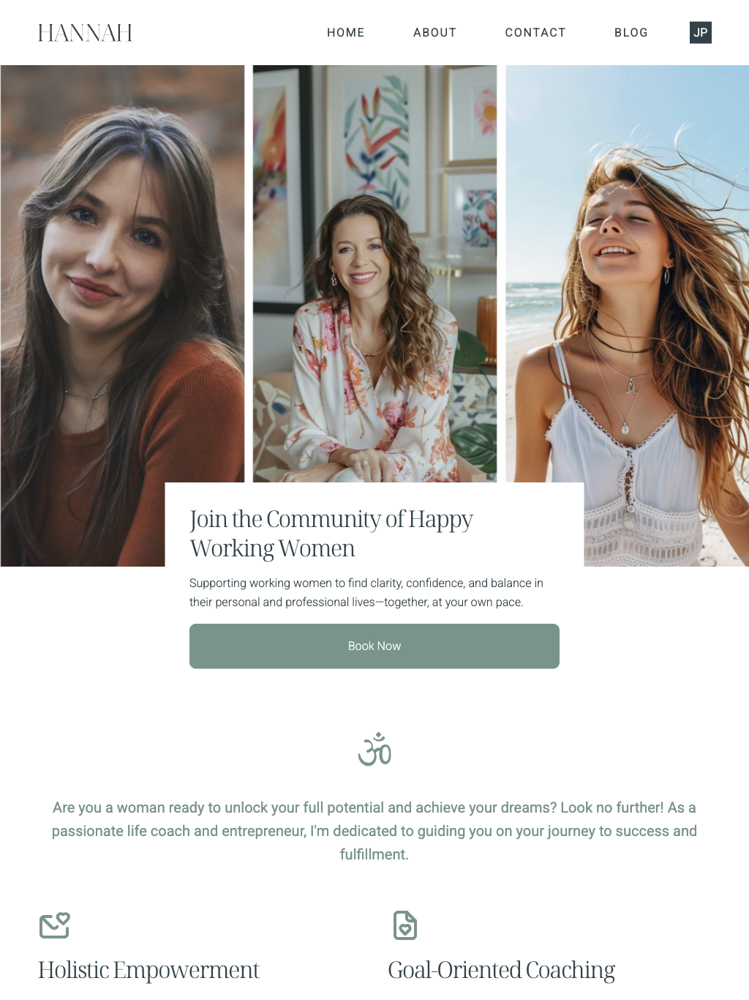

# hannah-female-life-coach

 

**_日本語_**

女性向けライフコーチのランディングページ – レスポンシブ・バイリンガル（英語/日本語）

Hannah – Female Life Coach Website

女性向けライフコーチ、Hannah さんのランディングページです。個人の成長や感情の安定、女性の人生の歩みを支援することを目的としています。

このウェブサイトは、練習用プロジェクトかつウェブ開発ポートフォリオとして制作され、整った HTML 構造、レスポンシブデザイン、基本的な JavaScript の操作を重視しています。

**ライブデモ:**
https://ifa-pdn.github.io/hannah-female-life-coach/

**プレビュー:**

_デスクトップ_

  

_タブレット - モバイル_

  
  

**主な機能:**

- シンプルで落ち着いたランディングページデザイン
- 完全レスポンシブ（モバイル、タブレット、デスクトップ対応）
- 多言語対応（英語 / 日本語）
- 構造化されたセクション：Hero、About、Services、Reviews、CTA
- JavaScript による DOM 操作・イベントハンドリング
- Open Graph メタタグ（ソーシャルシェア用に対応済み）
- GitHub Pages によるデプロイ

**使用技術:**

- HTML5 – セマンティック HTML
- CSS3 / SCSS – レイアウト・スタイリング
- JavaScript (Vanilla) – DOM 操作・インタラクション
- Swiper.js – レスポンシブスライダー / カルーセル
- Git & GitHub – バージョン管理
- GitHub Pages – デプロイ

**プロジェクトの目的:**

- HTML、CSS、基本的な JavaScript の実装練習
- Git のワークフロー（add、commit、push）に慣れる
- ジュニア Web 開発者向けポートフォリオプロジェクトの準備
- 静的ウェブサイトのデプロイ手順を学ぶ

**注意:**

- このプロジェクトは静的ウェブサイトであり、バックエンドやデータベースには接続されていません。
- ウェブサイトのデザインには、templatesjungle.com が提供する無料の Figma テンプレートを使用しています。
  [shorturl.at/xWSaL][templatesjungle.com]
- HTML、SCSS、JavaScript の実装はすべて自作です。

**作者:**
Iwan Fauzan
ジュニア Web 開発者
GitHub: https://github.com/ifa-pdn

---

**_English_**

Landing Page for a Female Life Coach – Responsive, Bilingual (English/Japanese)

Hannah – Female Life Coach Website

A landing page website for Hannah, a Female Life Coach, focused on personal development, emotional wellness, and women’s life journey in a personalized and sustainable way.

This website was created both as a practice project and as a web development portfolio, emphasizing clean HTML structure, responsive design, and basic JavaScript interactions.

**Live Demo:**
https://ifa-pdn.github.io/hannah-female-life-coach/

**Preview:**

_Desktop_

  

_Tablet - Mobile_

  
  

**Key Features:**

- Clean and calming landing page design
- Fully responsive (mobile, tablet, desktop)
- Multi-language support (English / Japanese)
- Structured sections: Hero, About, Services, Reviews, CTA
- JavaScript DOM manipulation & event handling
- Open Graph meta tags (ready for social sharing)
- Deployed via GitHub Pages

**Technologies Used:**

- HTML5 – Semantic HTML
- CSS3 / SCSS – Layout & styling
- JavaScript (Vanilla) – DOM manipulation & interactions
- Swiper.js – Responsive sliders / carousels
- Git & GitHub – Version control
- GitHub Pages – Deployment

**Project Goals:**

- Practice implementing HTML, CSS, and basic JavaScript
- Familiarize with Git workflow (add, commit, push)
- Prepare a portfolio project for a Junior Web Developer role
- Learn the process of deploying a static website

**Note:**

- This project is a static website and is not connected to a backend or database.
- The website design uses a free Figma template from templatesjungle [shorturl.at/xWSaL][templatesjungle.com].
- The HTML, SCSS, and JavaScript implementation was done independently.

**Author:**
Iwan Fauzan
Web Developer (Junior)
GitHub: https://github.com/ifa-pdn

---

**_Bahasa Indonesia_**

Landing page responsif dwibahasa (Inggris/Jepang) untuk seorang Pembimbing pengembangan diri wanita, dibangun dengan HTML, SCSS, dan JavaScript.

Hannah – Female Life Coach Website

Website landing page untuk Hannah, seorang Female Life Coach, yang berfokus pada pengembangan diri, ketenangan emosional, dan perjalanan hidup perempuan secara personal dan berkelanjutan.

Website ini dibuat sebagai latihan sekaligus portofolio web development, dengan penekanan pada struktur HTML yang rapi, desain responsif, dan interaksi JavaScript dasar.

**Live Demo:**
https://ifa-pdn.github.io/hannah-female-life-coach/

**Preview:**

_Desktop_

  

_Tablet - Mobile_

  
  

**Fitur Utama:**

- Desain landing page yang bersih dan tenang
- Responsif (mobile, tablet, desktop)
- Multi-language (English / Japanese)
- Section terstruktur: Hero, About, Services, Reviews, CTA
- JavaScript DOM & Event Handling
- Open Graph meta tag (siap untuk social sharing)
- Deploy menggunakan GitHub Pages

**Teknologi yang Digunakan:**

- HTML5 – Semantic HTML
- CSS3 / SCSS – Layout & styling
- JavaScript (Vanilla) – DOM manipulation & interaksi
- Swiper.js – Responsive sliders / carousels
- Git & GitHub – Version control
- GitHub Pages – Deployment

**Tujuan Proyek:**

- Melatih implementasi HTML, CSS, dan JavaScript dasar
- Membiasakan workflow Git (add, commit, push)
- Mempersiapkan proyek portofolio untuk Web Developer Junior
- Mempelajari proses deployment website statis

**Catatan:**

- Proyek ini merupakan website statis dan belum terhubung dengan backend atau database.
- Desain website menggunakan template Figma gratis dari [shorturl.at/xWSaL][templatesjungle.com].
- Implementasi HTML, SCSS, dan JavaScript dikerjakan secara mandiri.

**Author:**
Iwan Fauzan
Web Developer (Junior)
GitHub: https://github.com/ifa-pdn
